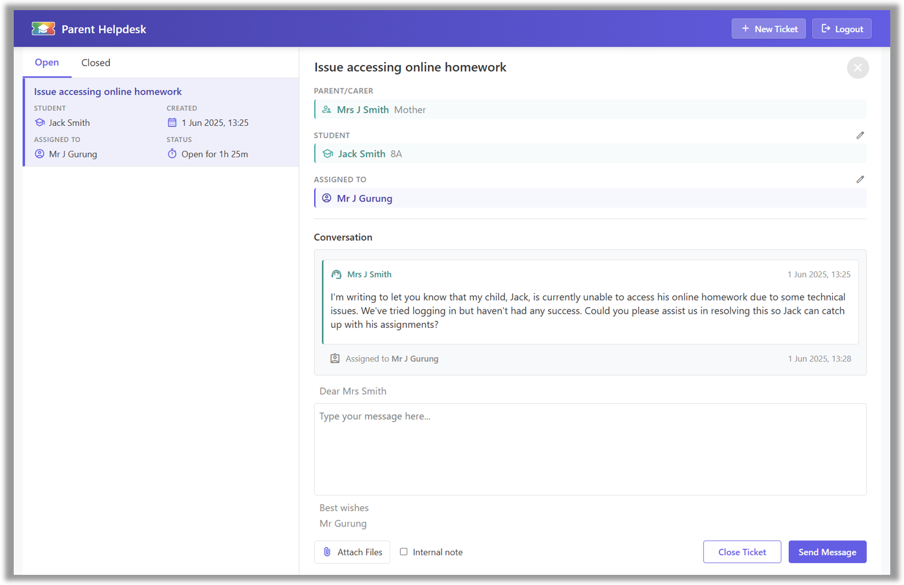

# School Helpdesk

School Helpdesk is a free, open-source web application designed to streamline communication between parents/carers and staff.

Bring your own Postmark account and deploy effortlessly to Microsoft Azure.



### Features

* A simple, professional ticketing interface
* Email-based ticket submission from verified parents
* Tagging of parent and student information
* Ticket assignment to specific staff
* AI assistance when responding to tickets
* Automated notifications and follow-up reminders
* Customisable email templates
* Role-based access control for managers and staff
* Support for all screen sizes including mobile
* Single sign-on (SSO) using Microsoft 365

### Setup

1. Create a [Postmark](https://account.postmarkapp.com) Pro account.
    * Add a sender signature for your school's email domain and verify it using DNS
    * Add a server called `Helpdesk`

2. Create a general purpose v2 storage account in [Microsoft Azure](http://portal.azure.com), and within it create:
    * Blob containers: `config`, `messages`, and `attachments`
    * Queue: `emails`
    * Table: `tickets`

3. Within the `config` blob container:

    * Upload a blank file `keys.xml`. Generate a SAS URL for this file with read/write permissions and a distant expiry. This will be used to store the application's data protection keys so that auth cookies persist across app restarts.

    * Upload a file `students.csv` with the following headers and populate it with all students in your school. Where a student has more than one parent, repeat the student details across multiple rows. To correctly represent accented characters in student names, save the file in 'CSV UTF-8' format.

        ```csv
        FirstName,LastName,TutorGroup,Relationship,ParentTitle,ParentFirstName,ParentLastName,ParentEmailAddress,ParentPhoneNumber
        ```

    * Upload a file `staff.csv` with the following headers and populate it with all staff in your school who should have access to the helpdesk.
    
        ```csv
        Email,Title,FirstName,LastName
        ```
    
    * Upload `template.html` and `template.txt` templates to use for all outgoing emails. There are sample files in the [examples](examples) folder. Use the token `{{BODY}}` as a placeholder for the email body.

4. Create an [Azure AI Foundry](https://ai.azure.com/) project and deploy a model that you would like to use for generating suggested ticket responses.

5. Create an Azure app registration.
    * Name - `School Helpdesk`
    * Redirect URI - `https://<app-website-domain>/signin-oidc`
    * Implicit grant - ID tokens
    * Supported account types - Accounts in this organizational directory only
    * API permissions - `Microsoft Graph - User.Read`
    * Token configuration - add an optional claim of type ID: `upn`

6. Create an Azure App Service web app.
    * Publish mode - Container
    * Operating system - Linux
    * Image source - Other container registries
    * Docker Hub access type - Public
    * Image and tag - `jamesgurung/school-helpdesk:latest`
    * Startup command: (blank)

7. Configure the following environment variables for the web app:

    * `Azure__AIFoundryApiKey` - the API key for your Azure AI Foundry project
    * `Azure__AIFoundryDeployment` - the name of the deployed model that you would like to use
    * `Azure__AIFoundryEndpoint` - the endpoint URL for your Azure AI Foundry deployment, up to and including the deployment name; for OpenAI models, this looks like `https://<project>.cognitiveservices.azure.com/openai/deployments/<model>`
    * `Azure__ClientId` - the client ID of your Azure app registration
    * `Azure__DataProtectionBlobUri` - the SAS URL for the keys file you created earlier
    * `Azure__StorageAccountKey` - the key for your Azure Storage account
    * `Azure__StorageAccountName` - the name of your Azure Storage account
    * `Azure__TenantId` - your Azure tenant ID
    * `Postmark__InboundAuthKey` - a secret UUID of your choice, used to verify that incoming emails are from Postmark
    * `Postmark__ServerToken` - the token for your Postmark server
    * `School__Admins__0` - the email address of the first admin user, who has full administrative access (subsequent admins can be configured by adding items with incrementing indices)
    * `School__AppWebsite` - the host name where this app will be hosted, e.g. `example.com`
    * `School__HelpdeskEmail` - the email address that will be used to send and receive helpdesk tickets
    * `School__Managers__0` - the email address of the first manager, who can create, view, and edit all tickets (subsequent managers can be configured by adding items with incrementing indices)
    * `School__Name` - the name of your school
    * `School__NotifyFirstManager` - set to `true` if you want the first manager configured above to be notified of new tickets submitted by email
    * `School__SyncApiKey` - the secret key to use if you update the `students.csv` and `staff.csv` files with an automated script (optional)

8. Configure your Postmark server's Default Inbound Stream settings:
    * Set the webhook to `https://<app-website-domain>/inbound?auth=<authkey>`
    * On your school's main email server, configure your helpdesk email address to auto-forward to the Postmark inbound email address shown on the settings page

### Contributing

If you have a question or feature request, please open an issue.

To contribute improvements to this project, or to adapt the code for the specific needs of your school, you are welcome to fork the repository.

Pull requests are welcome; please open an issue first to discuss.