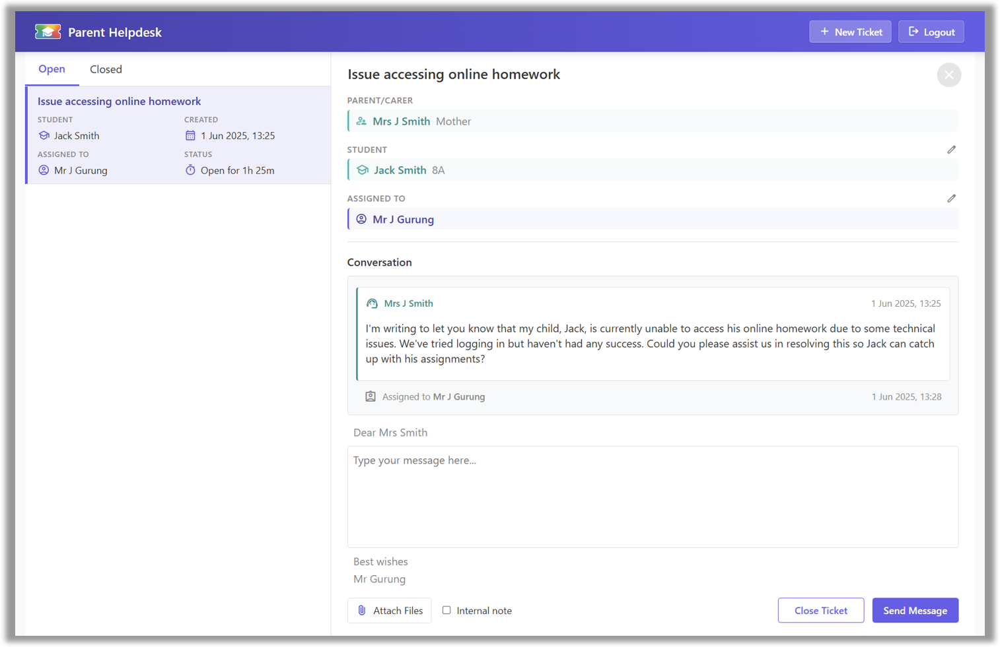

# School Helpdesk

School Helpdesk is a free, open-source web application designed to streamline communication between parents/carers and staff.

Bring your own Postmark account and deploy effortlessly to Microsoft Azure.



### Features

- A clean, professional ticketing interface
- Email-based ticket submission for verified parents
- Automatic tagging of parent and student details
- Ticket assignment to specific staff
- Powerful search to quickly find previous tickets
- AI-assisted drafting to support faster, more consistent responses
- Automated notifications and follow-up reminders
- Customisable email templates
- Role-based access control for managers and staff
- Fully responsive design for desktop, tablet, and mobile use
- Microsoft 365 single sign-on for secure and convenient access

### Setup

1. Create a [Postmark](https://account.postmarkapp.com) Pro account.
    - Add a sender signature for your school's email domain and verify it using DNS
    - Add a server called `Helpdesk`

2. Create a general purpose v2 storage account in [Microsoft Azure](http://portal.azure.com), and within it create:
    - Blob containers: `config`, `messages`, and `attachments`
    - Queue: `emails`
    - Table: `tickets`

3. Within the `config` blob container:

    - Upload a blank file `keys.xml`. Generate a SAS URL for this file with read/write permissions and a distant expiry. This will be used to store the application's data protection keys so that auth cookies persist across app restarts.
    
    - Upload a file `holidays.csv` with the following headers and populate it with your school's holiday dates in `yyyy-MM-dd` format. The start and end dates are inclusive. Reminder emails will not be sent to staff during holidays.
        ```csv
        Start,End
        ```

    - Upload a file `students.csv` with the following headers and populate it with all students in your school. Where a student has more than one parent, repeat the student details across multiple rows. To correctly represent accented characters in student names, save the file in 'CSV UTF-8' format.

        ```csv
        FirstName,LastName,TutorGroup,Relationship,ParentTitle,ParentFirstName,ParentLastName,ParentEmailAddress,ParentPhoneNumber
        ```

    - Upload a file `staff.csv` with the following headers and populate it with all staff in your school who should have access to the helpdesk.
    
        ```csv
        Email,Title,FirstName,LastName
        ```
    
    - Upload a file `blocklist.txt` containing one email address or domain per line that should be blocked from contacting the helpdesk. Emails from these addresses will be ignored with no bounce message sent. This is useful for blocking spam. Registered parents cannot be blocked.
    
    - Upload `template.html` and `template.txt` templates to use for all outgoing emails. There are sample files in the [examples](examples) folder. Use the token `{{BODY}}` as a placeholder for the email body.

4. Create an [Azure AI Foundry](https://ai.azure.com/) project and deploy an OpenAI reasoning model (e.g. `gpt-5`) that you would like to use for generating suggested ticket responses.

5. Create an Azure app registration.
    - Name - `School Helpdesk`
    - Redirect URI - `https://<app-website-domain>/signin-oidc`
    - Implicit grant - ID tokens
    - Supported account types - Accounts in this organizational directory only
    - API permissions - `Microsoft Graph - User.Read`
    - Token configuration - add an optional claim of type ID: `upn`
    - Certificates & secrets - create a new client secret

6. Create an Azure App Service web app.
    - Publish mode - Container
    - Operating system - Linux
    - Image source - Other container registries
    - Container name - `main`
    - Access type - Public
    - Registry server URL - `https://index.docker.io`
    - Image and tag - `jamesgurung/school-helpdesk:latest`
    - Port - 8080
    - Startup command: (blank)

7. Configure the application settings as described below.

    #### Bootstrap settings

    If you wish to load settings from Azure App Configuration, specify one of the following:

    - `AppConfigurationEndpoint` - Azure App Configuration endpoint. Enable the App Service's system-assigned managed identity and grant it the App Configuration Data Reader role.
    - `ConnectionStrings:AppConfiguration` - Azure App Configuration connection string.

    #### Application settings

    The remaining application settings are loaded from the `Shared:*` and `SchoolHelpdesk:*` keys in Azure App Configuration, or from your local configuration:

    - `Admins` - a comma-separated list of admin email addresses; admins have full administrative access
    - `AIFoundryApiKey` - the API key for your Azure AI Foundry project
    - `AIFoundryDeployment` - the name of the deployed OpenAI model that you would like to use
    - `AIFoundryEndpoint` - the endpoint URL for your Azure AI Foundry deployment, e.g. `https://<project>.cognitiveservices.azure.com/`
    - `AppWebsite` - the host name where this app will be hosted, e.g. `example.com`
    - `DataProtectionBlobUri` - the SAS URL for the keys file you created earlier
    - `DebugEmail` - the email address to which emails are redirected when debugging (optional)
    - `Dispatchers` - a comma-separated list of dispatcher email addresses; dispatchers can assign tickets to staff
    - `ForwardingProvider` - the provider that forwards inbound helpdesk email; must be `Microsoft` or `Google`
    - `HelpdeskEmail` - the email address that will be used to send and receive helpdesk tickets
    - `Managers` - a comma-separated list of manager email addresses; managers can create, view, and edit all tickets
    - `MicrosoftClientId` - the client ID of your Microsoft Entra app registration
    - `MicrosoftClientSecret` - the client secret of your Microsoft Entra app registration
    - `MicrosoftTenantId` - your Microsoft Entra tenant ID
    - `NotifyFirstManager` - set to `true` to notify the first email address in `Managers` of new tickets submitted by email
    - `PostmarkInboundAuthKey` - a secret UUID of your choice, used to verify that incoming emails are from Postmark
    - `PostmarkServerToken` - the token for your Postmark server
    - `SchoolName` - the name of your school
    - `StorageAccountKey` - the key for your Azure Storage account
    - `StorageAccountName` - the name of your Azure Storage account
    - `SyncApiKey` - the secret key to use if you update the `students.csv` and `staff.csv` files with an automated script (optional)

8. Configure your Postmark server's Default Inbound Stream settings:
    - Set the webhook to `https://<app-website-domain>/inbound?auth=<authkey>`
    - In Exchange or Google Workspace, configure a routing rule that auto-forwards your helpdesk email address to the Postmark inbound email address shown on the settings page

### Sender verification

The inbound relay chain is trusted as follows:

- **School email server → Postmark:** the Postmark inbound address is secret.
- **Postmark → helpdesk app:** the webhook `auth` value is secret.

When an email is received, the helpdesk app verifies the sender in the following order:

1. **Verify the webhook.** Require the webhook `auth` value to match `PostmarkInboundAuthKey`.
2. **Verify the forwarding relay.** Require the relay to pass SPF.
3. **Reject spam.** Check Postmark's `X-Spam-Status` header, if present, and reject messages marked as spam.
4. **Verify the original sender.** Require at least one of the following checks to pass:
   - Postmark's `X-Spam-Tests` header contains `DKIM_VALID_AU`.
   - For schools using Microsoft email servers, the first `Authentication-Results` header contains either `compauth=pass` or `dmarc=pass`.
   - For schools using Google email servers, the first `Authentication-Results` header contains `dmarc=pass`, or contains `dkim=pass` or `spf=pass` with the authenticated `header.d`/`header.i` or `smtp.mailfrom` domain exactly matching the domain in the `From` address.
5. **Reject automated replies.** Reject messages whose `Auto-Submitted` header is present and has any value other than `no`. Also reject messages with a subject beginning `Automatic reply: `.
6. **Require a registered parent address.** Create tickets only when the sender address belongs to a registered parent. At this stage only, unknown addresses receive an automated rejection reply.

### Contributing

If you have a question or feature request, please open an issue.

To contribute improvements to this project, or to adapt the code for the specific needs of your school, you are welcome to fork the repository.

Pull requests are welcome; please open an issue first to discuss.
